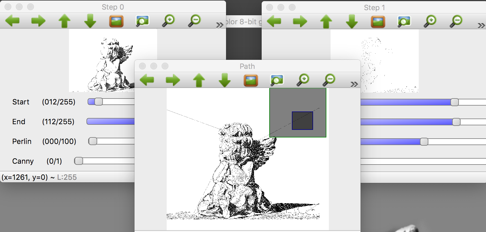
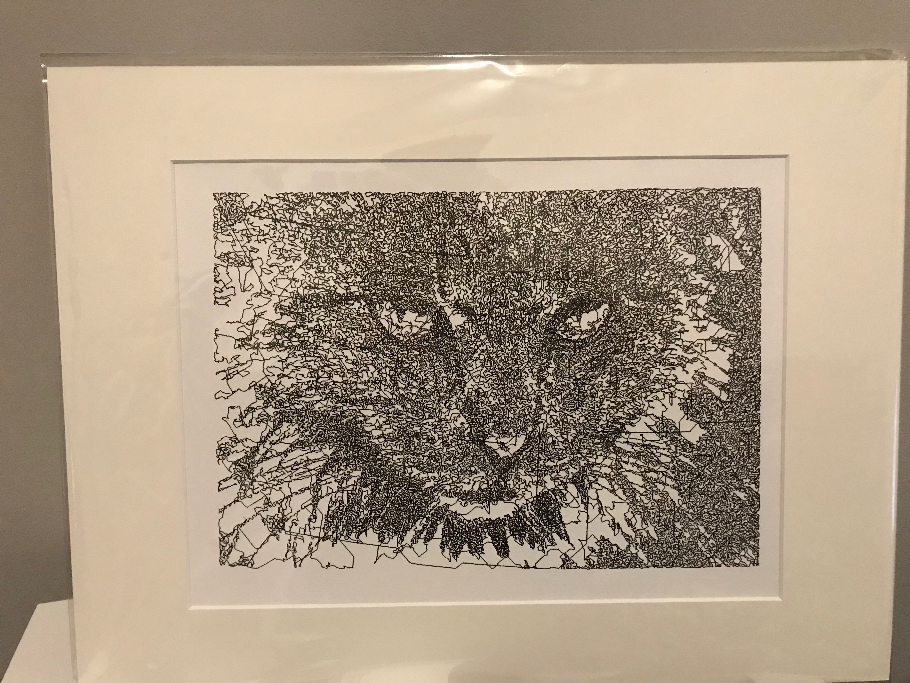
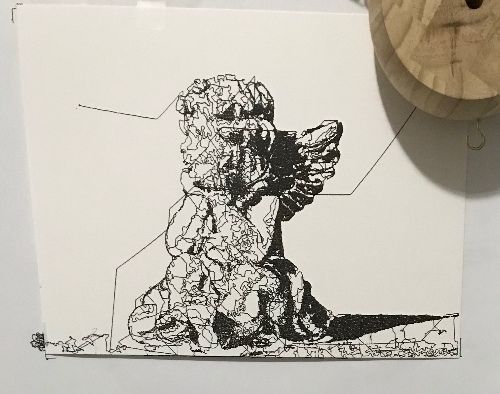
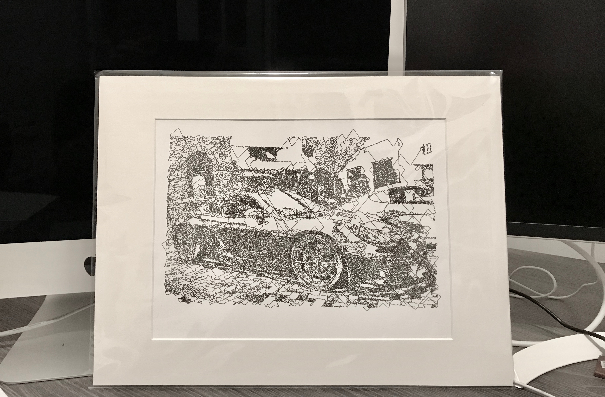

# Draw-Bot

A complete xcode project that enables users to take a standard png/jpeg/etc image and create a single stroke path for drawing. Includes UI components to make adjustments as well as layering.

## Features

Filter images, add noise, live preview (layer flatten) as well as final rendering of the drawing. Instructions to the drawing machine are outputted to a csv file.

## Installing/Getting Started

#### Installation Requirments
OpenCV 3.4 http://www.opencv.org
Components to build drawing machine (if desired)

#### Initial Configuration
1. You will need to compile OpenCV 3.0 to include the Qt5 library components. Unfortunately most if not all of the binary distributions do not include this.

2. Building of the drawbot is beyond the scope and there are many ways to make one. See pictures below of the one I built

#### Drawing Tips
- Larger images can take 8 or more hours to draw. Often the step count is in the hundreds of thousands for the examples below.
- A good ink drawing pen makes a big difference in the color depth. A standard ball-point pen will work, but is only recommended for testing and not the final product.
- Calibration can be very time consuming. The key is to get the correct starting point to avoid distorted images.

### Usage
1. Build and run the grayscale_filter target. You'll need to adjust the arguments to the Run to include the name of the image. Kinda manual

2. Edit the image as needed. Press 'r' to refresh the preview. Press 'p' to generate the path as well as the file.

3. (Optional) Save your current settings for the image editing. This will persist your edits for future use. Note: Does not save every change. You must manually do it.

4. Feed the output file to your drawbot. The format of the csv is motor number,direction,steps

## Examples

## TODO
- Add drawbot build instructions
- Upload Arduino code
- Clean up the UI
- Speed up drawing

## Social
[Facebook Page](https://www.facebook.com/LineArtByDrawBot/ "Facebook Page")

## License
Apache
